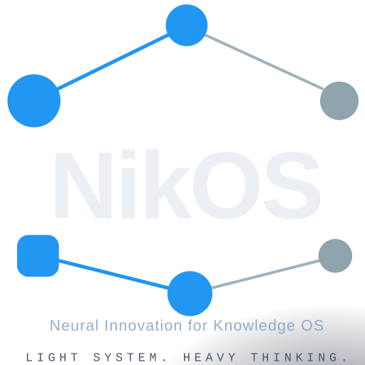

# NikOS — Neural Innovation for Knowledge OS

> **Light system. Heavy thinking.**

[](https://github.com/nikolareljin/nikos/actions/workflows/lint.yml)
[](https://github.com/nikolareljin/nikos/actions/workflows/test.yml)

A curated Xubuntu / Ubuntu 24.04 LTS setup for AI coding and development.  
One command turns a fresh Ubuntu install into a fully configured AI workstation — Xfce desktop with Nordic theme, local and cloud AI stack, developer tools, and GitHub integration all pre-configured.

**Version:** 0.2.1 · **License:** MIT · **Author:** Nikola Reljin



---

## Install

```bash
curl -fsSL https://raw.githubusercontent.com/nikolareljin/nikos/main/install.sh | bash
```

The installer clones the full repo (with submodules) to `~/.local/share/nikos`, presents a
`dialog`-based TUI to select optional bundles, then runs the Ansible playbook.
Set `NIKOS_USE_DIALOG=0` to force the plain-prompt fallback.
Log out and back in when done — Xfce starts on the next login.

**Clone locally (for development or offline use):**

```bash
git clone --recurse-submodules https://github.com/nikolareljin/nikos
cd nikos
bash install.sh
```

At the end, you should end up with something like: 


---

## What's included

### Desktop
| Component | Choice |
|---|---|
| Desktop environment | Xfce 4 |
| GTK theme | Nordic (Nord palette) |
| Icon theme | Papirus-Dark |
| Login screen | LightDM + Nordic greeter |
| Boot splash | Plymouth — NikOS logo on Nord dark |
| GRUB theme | Nordic |
| Wallpaper | NikOS logo on Nord dark |
| Terminal font | JetBrains Mono |

### AI stack
| Tool | Purpose |
|---|---|
| [Ollama](https://ollama.ai) | Local LLM runtime — `qwen2.5-coder:7b` pre-pulled |
| [aider](https://aider.chat) | AI pair programmer in the terminal |
| [Miniforge](https://github.com/conda-forge/miniforge) | Python distribution (conda) |
| `nikos-ai` conda env | Python 3.11 + PyTorch CPU + Jupyter + transformers + pandas |
| [Claude Code](https://github.com/anthropics/claude-code) | Anthropic's AI coding CLI |
| [Gemini CLI](https://github.com/google-gemini/gemini-cli) | Google Gemini in the terminal |
| GitHub Copilot CLI | `gh copilot` extension |
| LangChain + LlamaIndex | Agent framework libraries |
| [ai-runner](https://github.com/nikolareljin/ai-runner) | Simple UI for local Ollama models |

### IDE
| Tool | Detail |
|---|---|
| VS Code | Installed via Microsoft apt repo |
| Continue | AI code completion |
| GitLens | Git history in editor |
| GitHub Copilot | AI suggestions |
| Nord theme | `arcticicestudio.nord-visual-studio-code` |
| Python + Jupyter | Official MS extensions |

### Developer tools
Installed via [distrodeck](https://github.com/nikolareljin/distrodeck):
`bat` · `eza` · `fzf` · `lazygit` · `gh` · `rust` · `go` · `docker` · and more

Additional tools installed directly:
| Tool | Command | Purpose |
|---|---|---|
| [image-view](https://github.com/nikolareljin/image-view) | `image-view` | Terminal image preview (Rust) |
| [git-lantern](https://github.com/nikolareljin/git-lantern) | `lantern` | Repo dashboard — local + GitHub status |

### GitHub integration
- `gh` CLI pre-installed
- First-login wizard: authenticates GitHub, generates SSH key, configures git identity
- Optional dotfiles pull from your GitHub repo

---

## Commands

```
nikos setup          # run full playbook (first install)
nikos update         # git pull --ff-only + submodule sync + playbook re-run
nikos add network    # install optional: nmap, wireshark, OpenVPN
nikos add music      # install optional: LMMS, Ardour, Audacity
nikos add education  # install optional: LibreOffice, draw.io, Anki
nikos status         # show version, Ollama models, conda envs
nikos doctor         # check for broken configs and missing tools
```

---

## Customization

Create `vars/local.yml` before running the playbook to override defaults without
editing tracked files:

```yaml
nikos_timezone: "Europe/London"     # override this for your timezone
ollama_default_model: "qwen2.5-coder:7b"  # model to pre-pull
nikos_vscode_extensions:            # add/remove VS Code extensions
  - "Continue.continue"
  - ...
```

To add optional bundles after install:

```bash
nikos add network
nikos add music
nikos add education
```

See [docs/customization.md](docs/customization.md) for full details.

---

## Ecosystem

NikOS is the workstation layer of a broader AI development toolkit maintained by Nikola Reljin:

| Repo | Purpose |
|---|---|
| [nikolareljin/nikos](https://github.com/nikolareljin/nikos) | This repo — workstation setup |
| [nikolareljin/distrodeck](https://github.com/nikolareljin/distrodeck) | Cross-distro CLI tool installer (used by dev-tools role) |
| [nikolareljin/ai-runner](https://github.com/nikolareljin/ai-runner) | Local Ollama model runner with simple UI |
| [nikolareljin/finetorch](https://github.com/nikolareljin/finetorch) | Rust-native LLM finetuning — LoRA/QLoRA, dataset prep, training on a single GPU |
| [nikolareljin/shrink-llm](https://github.com/nikolareljin/shrink-llm) | LLM compression — quantization, pruning, knowledge distillation for mobile/edge |
| [nikolareljin/image-view](https://github.com/nikolareljin/image-view) | Terminal image preview CLI (pre-installed on NikOS) |
| [nikolareljin/git-lantern](https://github.com/nikolareljin/git-lantern) | Repo dashboard CLI — local + GitHub branch status (pre-installed on NikOS) |

### AI modeling workflow

NikOS provides the development environment. The modeling pipeline runs on top of it:

```
finetorch  →  train a custom model (LoRA/QLoRA, single GPU)
    ↓
shrink-llm →  compress for deployment (quantize, prune, distill)
    ↓
Ollama     →  serve locally on NikOS
    ↓
ai-runner  →  interact via simple UI
aider / Claude Code / Continue  →  use in code
```

---

## Documentation

- [Installation guide](docs/install.md) — detailed install, requirements, troubleshooting
- [Customization](docs/customization.md) — vars, roles, optional bundles
- [Debugging](docs/debugging.md) — `nikos doctor`, common issues, logs
- [Development](docs/development.md) — adding roles, testing, contributing

---

## License

MIT — Copyright © 2026 Nikola Reljin
