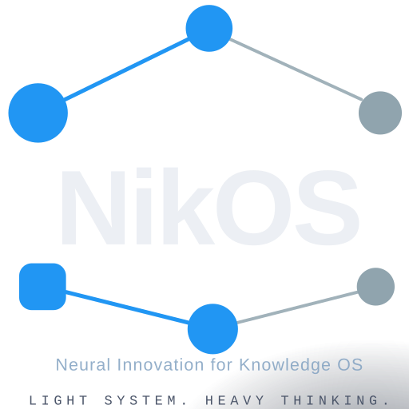

# NikOS — Neural Innovation for Knowledge OS

> **Light system. Heavy thinking.**

[](https://github.com/nikolareljin/nikos/actions/workflows/lint.yml)
[](https://github.com/nikolareljin/nikos/actions/workflows/test.yml)

A curated Xubuntu / Ubuntu 22.04, 24.04 and 26.04 LTS setup for AI coding and development.  
One command turns a fresh Ubuntu install into a fully configured AI workstation — Xubuntu desktop with Nordic theme, local and cloud AI stack, developer tools, and GitHub integration all pre-configured.

**Version:** 1.1.0 · **License:** MIT · **Author:** Nikola Reljin

> One file, the Plymouth boot splash, is GPL-3.0-or-later rather than MIT, because it is derived from Xubuntu's theme. See [THIRD-PARTY-NOTICES.md](THIRD-PARTY-NOTICES.md).



---

## Install

```bash
curl -fsSL https://raw.githubusercontent.com/nikolareljin/nikos/main/install.sh | bash
```

The installer clones the full repo (with submodules) to `~/.local/share/nikos`, moves it to
the **newest release tag**, presents a `dialog`-based TUI to select optional bundles, then
runs the Ansible playbook behind a per-role progress gauge.
The TUI follows the controlling terminal rather than stdin, so the one-liner above gets it too —
`curl ... | bash` leaves the script's own bytes on stdin, which is not a terminal on any machine.
Set `NIKOS_USE_DIALOG=0` to force the plain-prompt fallback.

The installer also asks for a **profile**: `desktop` (the default, the full
workstation) or `server` (Ubuntu Server or any headless machine: no desktop,
no theming, no VS Code; SSH, the AI stack, containers and databases stay).
A single laptop remains the default and complete install; see
[docs/profiles.md](docs/profiles.md) for the layers each profile gets.

Pass `--ref <branch-or-tag>` to install something other than the latest release.

Coming from Xubuntu, log out and back in. Coming from Ubuntu, reboot: the installer moves
the display manager from GDM3 to LightDM and sets the default session to Xubuntu, and
neither applies while the GNOME session that started the installer is running. The
installer tells you which one you need when it finishes.

**Clone locally (for development or offline use):**

```bash
git clone --recurse-submodules https://github.com/nikolareljin/nikos
cd nikos
bash install.sh          # installs the latest release tag, not this checkout
bash install.sh --dev    # installs this checkout, uncommitted changes included
```

`--dev` runs the tree it was launched from and never touches
`~/.local/share/nikos`, so testing a branch cannot break a working install.

At the end, you should end up with something like: 


---

## What's included

### Desktop
| Component | Choice |
|---|---|
| Desktop environment | Xubuntu (Xfce 4) |
| GTK theme | Nordic (Nord palette) |
| Icon theme | Papirus-Dark |
| Login screen | LightDM + Nordic greeter |
| Boot splash | Plymouth — NikOS logo on Nord dark |
| GRUB theme | NikOS logo on Nord dark |
| Browsers | Dark Firefox, Chromium and Google Chrome in the desktop colour |
| Wallpaper | NikOS logo on Nord dark |
| Terminal font | JetBrains Mono |

### AI stack
| Tool | Purpose |
|---|---|
| [Ollama](https://ollama.com) | Local LLM runtime, `qwen3.5:4b` pre-pulled |
| [aider](https://aider.chat) | AI pair programmer in the terminal, in its own `nikos-aider` env; run `aider` |
| [Miniforge](https://github.com/conda-forge/miniforge) | Python distribution (conda) |
| `nikos-ai` conda env | Python 3.11-3.13 + PyTorch CPU + Jupyter + transformers + pandas |
| [llama.cpp](https://github.com/ggml-org/llama.cpp) | Prebuilt binaries — `llama-server`, `llama-cli` |
| Retrieval stack | Chroma, Qdrant client, sentence-transformers |
| Image analysis | OpenCV, Pillow, scikit-image, timm, Tesseract OCR |
| [Claude Code](https://github.com/anthropics/claude-code) | Anthropic's AI coding CLI |
| [Gemini CLI](https://github.com/google-gemini/gemini-cli) | Google Gemini in the terminal |
| GitHub Copilot CLI | `gh copilot` extension |
| LangChain + LlamaIndex | Agent framework libraries |
| [ai-runner](https://github.com/nikolareljin/ai-runner) | Simple UI for local Ollama models |

### Local models

One model is pulled by default: `qwen3.5:4b` (3.4 GB). The rest are
grouped by what they are for, each with its own tag, so a laptop can take one
group without the others:

```bash
nikos add ollama-reasoning   # ~24 GB  deepseek-r1, qwen3, gpt-oss
nikos add ollama-coding      # ~24 GB  qwen2.5-coder, qwen3-coder
nikos add ollama-text        # ~16 GB  granite4, qwen3.5, gemma4
nikos add ollama-vision      # ~9.4 GB qwen3-vl
nikos add ollama-embedding   # ~1.3 GB embeddinggemma, qwen3-embedding
nikos add ollama-models      # ~75 GB  every group
```

Nothing is pulled unless you ask for the tag. Models load on demand, so this is
disk and bandwidth rather than idle memory.

### IDE
| Tool | Detail |
|---|---|
| VS Code | Installed via Microsoft apt repo |
| Continue | AI code completion |
| GitLens | Git history in editor |
| GitHub Copilot | AI suggestions |
| [Leak Lock](https://marketplace.visualstudio.com/items?itemName=nikolareljin.leak-lock) | Secret detection and leak prevention in VS Code |
| Nord theme | `arcticicestudio.nord-visual-studio-code` |
| Python + Jupyter | Official MS extensions |

### Developer tools
Installed via [distrodeck](https://github.com/nikolareljin/distrodeck): the
tools you pick from its catalog at install time or with `nikos add tools`
(`bat`, `eza`, `fzf`, `lazygit`, `gh`, `rust`, `go`, `docker`, databases and
more). A distrodeck release without a catalog installs its default set.

Additional tools installed directly:
| Tool | Command | Purpose |
|---|---|---|
| [image-view](https://github.com/nikolareljin/image-view) | `image-view` | Terminal image preview (Rust) |
| [git-lantern](https://github.com/nikolareljin/git-lantern) | `lantern` | Repo dashboard — local + GitHub status |

### Git host integration
- `gh` CLI pre-installed
- First-login wizard (`nikos-git-setup`): adds an SSH key to GitHub, GitLab,
  Bitbucket or a custom Git server, or skip it and manage keys yourself
- Configures git identity; optional dotfiles clone (`user/repo` or a git URL)

---

## Commands

```
nikos setup          # run full playbook (first install)
nikos update         # move to the newest release, then re-run the playbook
nikos update --ref X # update to a specific branch or tag instead
nikos add network    # install optional: nmap, wireshark, OpenVPN
nikos add music      # install optional: LMMS, Ardour, Audacity
nikos add education  # install optional: LibreOffice, draw.io, Anki
nikos add neovim     # install optional: Neovim + starter lazy.nvim config
nikos add java       # install optional: OpenJDK 21 (nikos_java_versions)
nikos add podman     # install optional: Podman
nikos add bun        # install optional: Bun JavaScript runtime
nikos add postgres   # install optional: PostgreSQL + pgvector
nikos add mongodb    # install optional: MongoDB, mongosh, Atlas CLI
nikos add redis      # install optional: Redis
nikos add qdrant     # install optional: Qdrant vector database
nikos add zsh        # install optional: Zsh + Starship
nikos add k8s-tools  # install optional: kubectl + Helm
nikos add act        # install optional: local GitHub Actions runner
nikos add fabric     # install optional: Fabric AI pattern CLI
nikos add jev        # install optional: Jev client (official TypeSafe SDK; `jev login` with your API key)
nikos add openclaw   # install optional: OpenClaw LLM gateway CLI
nikos add monitoring # install optional: Netdata
nikos add bitnet     # install optional: BitNet.cpp 1-bit inference (bitnet-cli)
nikos add mistral-rs # install optional: mistral.rs Rust LLM server
nikos add ollama-*   # install optional: a model group (see Local models above)
nikos status         # show version, Ollama models, conda envs
nikos doctor         # check for broken configs and missing tools
nikos log [N]        # tail the latest playbook log
```

`nikos update` reads its target from what is checked out: a release install
advances to the newest release only when that release is genuinely newer, and a
branch install stays on its branch. An update never downgrades. It then refreshes
the pinned `script-helpers` submodule, NikOS-managed tool repositories
(`distrodeck`, `image-view`, `git-lantern`, and `ai-runner`), Python/pipx
packages, VS Code extensions, Ollama models, and installed system packages
(apt, snap, and flatpak). The optional bundles selected during installation
remain selected.

Developer tools installed through distrodeck are refreshed by their package
manager, not by distrodeck: `distrodeck install-tools` has no upgrade mode and
skips a tool that is already present. Tools that came from apt, snap, or
flatpak are therefore refreshed; the handful installed with cargo, go, or npm
are not, and need reinstalling by hand until distrodeck grows an upgrade mode.

For a checkout-only refresh of the `script-helpers` revision pinned by this
NikOS release, run `./update` from the repository root.

---

## Verified installs

NikOS installs nothing it cannot verify: every download is pinned to a version
and checked against a sha256, every vendor apt key against a fingerprint, and
npm/pip/go installs use exact versions. No `curl | sh`. The pins live in one
file, [`vars/versions.yml`](vars/versions.yml); `scripts/bump-versions.py`
checks upstream (`--check`), moves pins forward with the vendor's own checksums
(`--bump`) and re-verifies every pin (`--verify`). `nikos update` treats a pin
as a minimum and never downgrades. Each install and update log ends with a
digest of failed tasks and warnings.

## Customization

Create `vars/local.yml` before running the playbook to override defaults without
editing tracked files:

```yaml
nikos_timezone: "Europe/London"     # override this for your timezone
ollama_default_model: "qwen3.5:4b"  # model to pre-pull
nikos_desktop_flavor: "xubuntu-minimal"   # or xubuntu-full / xfce
nikos_remove_gnome: false           # true purges GNOME instead of keeping it selectable
nikos_vscode_extensions:            # add/remove VS Code extensions
  - "Continue.continue"
  - ...
```

To add optional bundles after install:

```bash
nikos add network
nikos add music
nikos add education
nikos add postgres
nikos add ollama-models
```

See [docs/customization.md](docs/customization.md) for full details, and
[docs/bundles.md](docs/bundles.md) for the optional bundles you can pick at
install time.

---

## Ecosystem

NikOS is the workstation layer of a broader AI development toolkit maintained by Nikola Reljin:

| Repo | Purpose |
|---|---|
| [nikolareljin/nikos](https://github.com/nikolareljin/nikos) | This repo — workstation setup |
| [nikolareljin/distrodeck](https://github.com/nikolareljin/distrodeck) | Cross-distro CLI tool installer (used by dev-tools role) |
| [nikolareljin/ai-runner](https://github.com/nikolareljin/ai-runner) | Local Ollama model runner with simple UI |
| [nikolareljin/finetorch](https://github.com/nikolareljin/finetorch) | Rust-native LLM finetuning — LoRA/QLoRA, dataset prep, training on a single GPU |
| [nikolareljin/shrink-llm](https://github.com/nikolareljin/shrink-llm) | LLM compression — quantization, pruning, knowledge distillation for mobile/edge |
| [nikolareljin/image-view](https://github.com/nikolareljin/image-view) | Terminal image preview CLI (pre-installed on NikOS) |
| [nikolareljin/git-lantern](https://github.com/nikolareljin/git-lantern) | Repo dashboard CLI — local + GitHub branch status (pre-installed on NikOS) |

### AI modeling workflow

NikOS provides the development environment. The modeling pipeline runs on top of it:

```
finetorch  →  train a custom model (LoRA/QLoRA, single GPU)
    ↓
shrink-llm →  compress for deployment (quantize, prune, distill)
    ↓
Ollama     →  serve locally on NikOS
    ↓
ai-runner  →  interact via simple UI
aider / Claude Code / Continue  →  use in code
```

---

## Documentation

**[nikolareljin.github.io/nikos](https://nikolareljin.github.io/nikos/)** — overview, install guide and the full inventory.

- [Installation guide](docs/install.md) — detailed install, requirements, troubleshooting
- [Customization](docs/customization.md) — vars, roles, optional bundles
- [Profiles](docs/profiles.md) - desktop and server, and which roles each runs
- [Dual boot](docs/dual-boot.md) - os-prober, boot order, UEFI vs legacy, Secure Boot
- [Debugging](docs/debugging.md) — `nikos doctor`, common issues, logs
- [Development](docs/development.md) — adding roles, testing, contributing

## Contributing

Contributions are welcome: bug reports, fixes, new optional bundles, docs, and
testing on a wide range of machines and setups.

- **Found a problem?** [Open an issue](https://github.com/nikolareljin/nikos/issues/new/choose)
  and paste the log digest from the end of the install or update log
  ([how to get it](CONTRIBUTING.md#report-a-problem)).
- **Want to change something?** Read [CONTRIBUTING.md](CONTRIBUTING.md), then
  open a pull request. Issues labelled
  [good first issue](https://github.com/nikolareljin/nikos/labels/good%20first%20issue)
  and [help wanted](https://github.com/nikolareljin/nikos/labels/help%20wanted)
  are a good place to start.
- **Questions and ideas:** [Discussions](https://github.com/nikolareljin/nikos/discussions).
- **Security:** see [SECURITY.md](SECURITY.md).

Everyone taking part follows the [Code of Conduct](CODE_OF_CONDUCT.md).

---

## License

MIT — Copyright © 2026 Nikola Reljin


## Clone traffic


_Updated daily. Total and unique cloners over the last 14 days._
